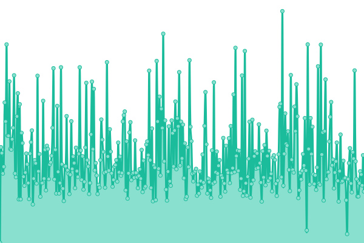
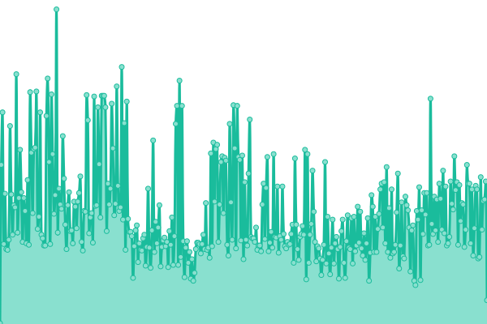
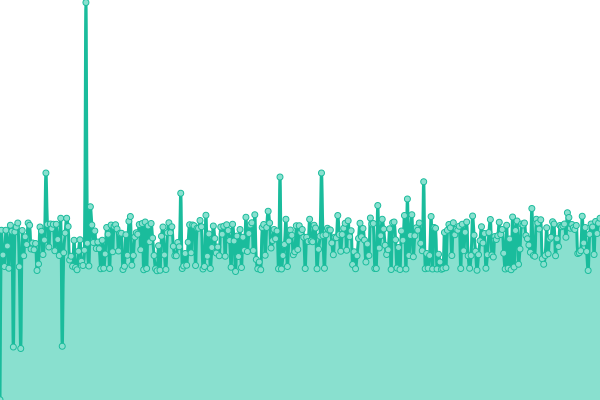
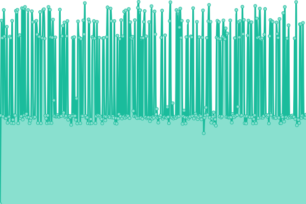
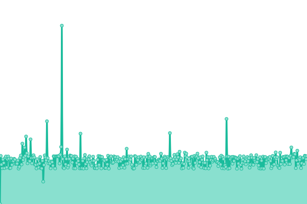
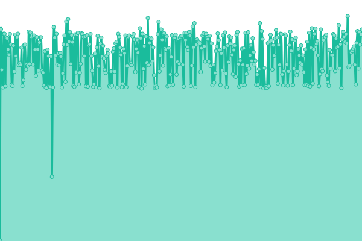

# 

This repository contains the open-source uptime monitor and status page for [Roblox Status](https://fearedfusionx.github.io/Ro-Status/), powered by [Upptime](https://github.com/upptime/upptime).

> Even though this site may almost always be accurate, Do not fully relly on it for Roblox Status. Instead, look up Status+ or go to the Offical Roblox Site Status.

Ro-Status is a Roblox Status site built off of Status+ and Roblox APIS. Ro-Status Monitors Roblox Outages and Degrations faster than Roblox can. All of this is possible to monitor thanks to [Upptime](https://github.com/upptime/upptime). Give the service a try!

# [▣ Live Status](https://fearedfusionx.github.io/Ro-Status/): <!--live status--> **🟩 All systems operational**

<!--start: status pages-->
<!-- This summary is generated by Upptime (https://github.com/upptime/upptime) -->
<!-- Do not edit this manually, your changes will be overwritten -->
<!-- prettier-ignore -->
| URL | Status | History | Response Time | Uptime |
| --- | ------ | ------- | ------------- | ------ |
|  [Roblox Site](https://www.roblox.com) | 🟩 Up | [roblox-site.yml](https://github.com/FearedFusionX/Ro-Status/commits/HEAD/history/roblox-site.yml) | 

 501ms
     
 | 

<a href="https://FearedFusionX.github.io/Ro-Status/history/roblox-site">100.00%</a>
    

|  [Roblox Devforum](https://devforum.roblox.com) | 🟩 Up | [roblox-devforum.yml](https://github.com/FearedFusionX/Ro-Status/commits/HEAD/history/roblox-devforum.yml) | 

 215ms
     
 | 

<a href="https://FearedFusionX.github.io/Ro-Status/history/roblox-devforum">100.00%</a>
    

|  [Roblox Devhub](https://developer.roblox.com) | 🟩 Up | [roblox-devhub.yml](https://github.com/FearedFusionX/Ro-Status/commits/HEAD/history/roblox-devhub.yml) | 

 500ms
     
 | 

<a href="https://FearedFusionX.github.io/Ro-Status/history/roblox-devhub">100.00%</a>
    

|  [Account Information API](https://accountinformation.roblox.com) | 🟩 Up | [account-information-api.yml](https://github.com/FearedFusionX/Ro-Status/commits/HEAD/history/account-information-api.yml) | 

 632ms
     
 | 

<a href="https://FearedFusionX.github.io/Ro-Status/history/account-information-api">100.00%</a>
    

|  [Account Settings API](https://accountsettings.roblox.com) | 🟩 Up | [account-settings-api.yml](https://github.com/FearedFusionX/Ro-Status/commits/HEAD/history/account-settings-api.yml) | 

 632ms
     
 | 

<a href="https://FearedFusionX.github.io/Ro-Status/history/account-settings-api">100.00%</a>
    

|  [Asset Delivery](https://assetdelivery.roblox.com) | 🟩 Up | [asset-delivery.yml](https://github.com/FearedFusionX/Ro-Status/commits/HEAD/history/asset-delivery.yml) | 

 630ms
     
 | 

<a href="https://FearedFusionX.github.io/Ro-Status/history/asset-delivery">100.00%</a>
    

|  [Avatar API Endpoint](https://avatar.roblox.com/v1/avatar-rules) | 🟩 Up | [avatar-api-endpoint.yml](https://github.com/FearedFusionX/Ro-Status/commits/HEAD/history/avatar-api-endpoint.yml) | 

 659ms
     
 | 

<a href="https://FearedFusionX.github.io/Ro-Status/history/avatar-api-endpoint">99.46%</a>
    

|  [Auth API Endpoint](https://auth.roblox.com) | 🟩 Up | [auth-api-endpoint.yml](https://github.com/FearedFusionX/Ro-Status/commits/HEAD/history/auth-api-endpoint.yml) | 

 626ms
     
 | 

<a href="https://FearedFusionX.github.io/Ro-Status/history/auth-api-endpoint">100.00%</a>
    

|  [Badges API Endpoint](https://badges.roblox.com/v1/badges/2124548403) | 🟩 Up | [badges-api-endpoint.yml](https://github.com/FearedFusionX/Ro-Status/commits/HEAD/history/badges-api-endpoint.yml) | 

 627ms
     
 | 

<a href="https://FearedFusionX.github.io/Ro-Status/history/badges-api-endpoint">100.00%</a>
    

|  [Billing API Endpoint](https://billing.roblox.com) | 🟩 Up | [billing-api-endpoint.yml](https://github.com/FearedFusionX/Ro-Status/commits/HEAD/history/billing-api-endpoint.yml) | 

 622ms
     
 | 

<a href="https://FearedFusionX.github.io/Ro-Status/history/billing-api-endpoint">100.00%</a>
    

|  [Catalog API Endpoint](https://catalog.roblox.com/v1/bundles/details?bundleIds=192) | 🟩 Up | [catalog-api-endpoint.yml](https://github.com/FearedFusionX/Ro-Status/commits/HEAD/history/catalog-api-endpoint.yml) | 

 642ms
     
 | 

<a href="https://FearedFusionX.github.io/Ro-Status/history/catalog-api-endpoint">100.00%</a>
    

|  [Datastore API Endpoint](https://gamepersistence.roblox.com/) | 🟩 Up | [datastore-api-endpoint.yml](https://github.com/FearedFusionX/Ro-Status/commits/HEAD/history/datastore-api-endpoint.yml) | 

 625ms
     
 | 

<a href="https://FearedFusionX.github.io/Ro-Status/history/datastore-api-endpoint">100.00%</a>
    

|  [Develop API Endpoint](http://develop.roblox.com/) | 🟩 Up | [develop-api-endpoint.yml](https://github.com/FearedFusionX/Ro-Status/commits/HEAD/history/develop-api-endpoint.yml) | 

 639ms
     
 | 

<a href="https://FearedFusionX.github.io/Ro-Status/history/develop-api-endpoint">100.00%</a>
    

|  [Economy API Endpoint](https://economy.roblox.com) | 🟩 Up | [economy-api-endpoint.yml](https://github.com/FearedFusionX/Ro-Status/commits/HEAD/history/economy-api-endpoint.yml) | 

 617ms
     
 | 

<a href="https://FearedFusionX.github.io/Ro-Status/history/economy-api-endpoint">100.00%</a>
    

|  [Friends API Endpoint](https://friends.roblox.com/v1/metadata) | 🟩 Up | [friends-api-endpoint.yml](https://github.com/FearedFusionX/Ro-Status/commits/HEAD/history/friends-api-endpoint.yml) | 

 617ms
     
 | 

<a href="https://FearedFusionX.github.io/Ro-Status/history/friends-api-endpoint">100.00%</a>
    

|  [Presence API](https://presence.roblox.com) | 🟩 Up | [presence-api.yml](https://github.com/FearedFusionX/Ro-Status/commits/HEAD/history/presence-api.yml) | 

 619ms
     
 | 

<a href="https://FearedFusionX.github.io/Ro-Status/history/presence-api">100.00%</a>
    

|  [Game Join API Endpoint](http://gamejoin.roblox.com/) | 🟩 Up | [game-join-api-endpoint.yml](https://github.com/FearedFusionX/Ro-Status/commits/HEAD/history/game-join-api-endpoint.yml) | 

 628ms
     
 | 

<a href="https://FearedFusionX.github.io/Ro-Status/history/game-join-api-endpoint">100.00%</a>
    

|  [Games API Endpoint](https://games.roblox.com) | 🟩 Up | [games-api-endpoint.yml](https://github.com/FearedFusionX/Ro-Status/commits/HEAD/history/games-api-endpoint.yml) | 

 618ms
     
 | 

<a href="https://FearedFusionX.github.io/Ro-Status/history/games-api-endpoint">100.00%</a>
    

|  [Groups API Endpoint](https://groups.roblox.com/v1/groups/5680533) | 🟩 Up | [groups-api-endpoint.yml](https://github.com/FearedFusionX/Ro-Status/commits/HEAD/history/groups-api-endpoint.yml) | 

 630ms
     
 | 

<a href="https://FearedFusionX.github.io/Ro-Status/history/groups-api-endpoint">100.00%</a>
    

|  [Inventory API Endpoint](https://inventory.roblox.com/v1/users/82738847/assets/collectibles?limit=10&sortOrder=Asc) | 🟩 Up | [inventory-api-endpoint.yml](https://github.com/FearedFusionX/Ro-Status/commits/HEAD/history/inventory-api-endpoint.yml) | 

 690ms
     
 | 

<a href="https://FearedFusionX.github.io/Ro-Status/history/inventory-api-endpoint">100.00%</a>
    

|  [Thumbnails API Endpoint](https://thumbnails.roblox.com/v1/assets?assetIds=82738847&format=Png&isCircular=false&size=30x30) | 🟩 Up | [thumbnails-api-endpoint.yml](https://github.com/FearedFusionX/Ro-Status/commits/HEAD/history/thumbnails-api-endpoint.yml) | 

 634ms
     
 | 

<a href="https://FearedFusionX.github.io/Ro-Status/history/thumbnails-api-endpoint">99.51%</a>
    

|  [Users API Endpoint](https://users.roblox.com/) | 🟩 Up | [users-api-endpoint.yml](https://github.com/FearedFusionX/Ro-Status/commits/HEAD/history/users-api-endpoint.yml) | 

 614ms
     
 | 

<a href="https://FearedFusionX.github.io/Ro-Status/history/users-api-endpoint">100.00%</a>
    

|  [Voice Chat API](https://voice.roblox.com/) | 🟩 Up | [voice-chat-api.yml](https://github.com/FearedFusionX/Ro-Status/commits/HEAD/history/voice-chat-api.yml) | 

 614ms
     
 | 

<a href="https://FearedFusionX.github.io/Ro-Status/history/voice-chat-api">100.00%</a>
    

<!--end: status pages-->

[**Visit our status website →**](https://fearedfusionx.github.io/Ro-Status/)

## 📄 License

- Powered by: [Upptime](https://github.com/upptime/upptime)
- Code: [MIT](./LICENSE) © [FearedFusionX](https://rostatus.js.org)
- Data in the `./history` directory: [Open Database License](https://opendatacommons.org/licenses/odbl/1-0/)
